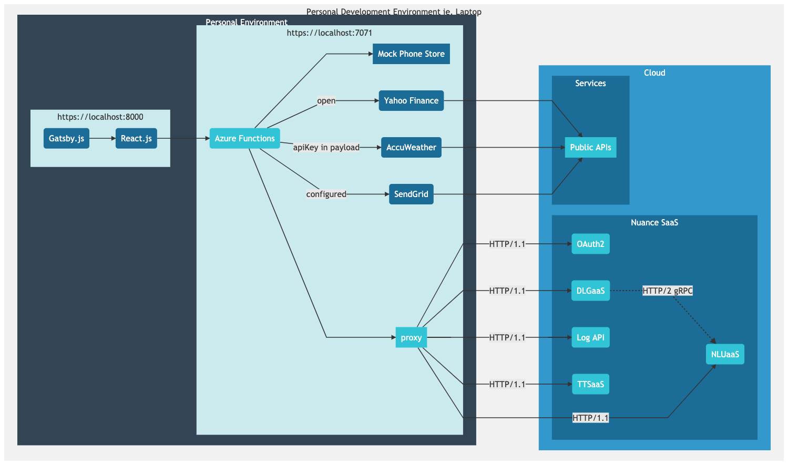
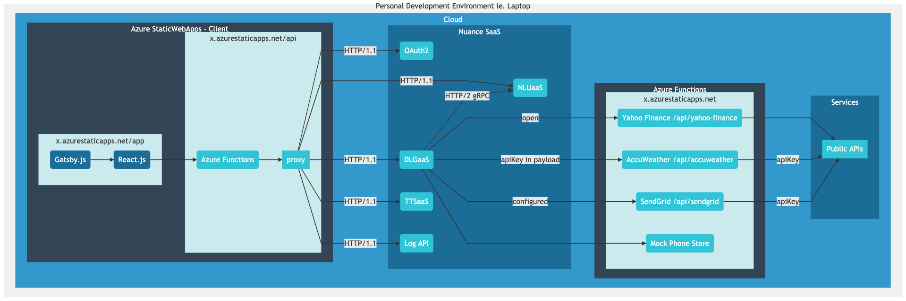

# Nuance Mix Demo Client

> Develop and Troubleshoot [Nuance Mix](https://nuance.com/mix) AI Powered Chat Bots locally and on Microsoft Azure.

## Table of contents
* [Overview](#overview)
* [About the Client](#about-the-client)
* [Setup](#setup)
* [Functionality](#functionality)
* [Pre-Requisites](#pre-requisites)
* [Quick Start 🚀](#quick-start-)
* [Getting Started](#getting-started)
* [Conventions for Rich UI](#conventions-for-rich-ui)
* [Conventions for Link Handling](#conventions-for-link-handling)
* [Data Access Integrations](#data-access-integrations)
* [Publishing to Azure](#publishing-to-azure)
* [License](#license)

## Overview

This demo client offers a sample integration to [Nuance Mix](https://www.nuance.com/mix?src=demo)'s Conversational AI [Runtime Services](https://docs.mix.nuance.com/runtime-services/#runtime-apis-quick-reference), specifically
* [Dialog (DLGaaS)](https://docs.mix.nuance.com/dialog-grpc/v1/)
* [Natural Language Understanding (NLUaaS)](https://docs.mix.nuance.com/nlu-grpc/v1/?src=demo)
* [Text to Speech (TTSaaS)](https://docs.mix.nuance.com/tts-grpc/v1/?src=demo) and the
* [Runtime Event Log API](https://docs.mix.nuance.com/runtime-event-logs/?src=demo)

The client uses the HTTP/1.1 transcoded version of the APIs (rather than the native HTTP/2 gRPC versions).

The prime purpose of this tool is to assist in Bot development and troubleshooting, including offering controlled hosted availability using [Azure StaticWebApps](https://azure.microsoft.com/en-us/services/app-service/static/).

[Azure Functions](https://docs.microsoft.com/en-us/azure/azure-functions/) with [Core Tools](https://docs.microsoft.com/en-us/azure/azure-functions/functions-run-local) are used throughout the development and deployment lifecycle.

For more information on how to leverage the client across various environments, see [networking options](https://docs.microsoft.com/en-us/azure/azure-functions/functions-networking-options), and be sure to [secure your functions](https://docs.microsoft.com/en-us/azure/azure-functions/security-concepts). Monitoring is made available through [Application Insights](https://docs.microsoft.com/en-us/azure/azure-monitor/app/app-insights-overview).

*Disclaimer: This sample client is not intended to illustrate a production-ready implementation; it is intended to aid development, demonstration, troubleshooting, and other such use cases.*

## About the Client

* [Gatsby](https://www.gatsbyjs.com), [React](https://reactjs.org) and [React-Bootstrap](https://react-bootstrap.github.io/) for the Client/Frontend
* [Azure Functions Python](https://docs.microsoft.com/en-us/azure/azure-functions/functions-reference-python) for the API
  * Acts as a Proxy for Nuance Services, with Data Integrations for Mix.dialog/DLGaaS

## Setup

Please see the [Exchanging data](https://docs.mix.nuance.com/data-access/?src=demo) section in the [Mix documentation](https://docs.mix.nuance.com/?src=demo). It is crucial to understand the concepts as you design your Mix projects and leverage this client -- it acts more like a gateway.

### Intended Local Use

Use Data Access nodes with the `client_fetch` configuration and write the integration layer locally with the **intention** of separate hosted Functions (through `external_fetch`). These Functions would be referenced and configured within Mix.dialog and Mix.dashboard respectively.



### Intended Hosted Use

The following illustrates a scenario where the client is deployed to Azure, and Data Access nodes have been configured to use `external_fetch` within Mix.

This simplifies the client handling, deferring to the Functions themselves, and offers lifecycle controls within Mix.



⚠️ There may be scenarios where `client_fetch` is appropriate; this has been set up such that `dlgaas.js` will invoke local `ClientFetchHandlers`.


## Functionality

* [x] Bot engagements using Nuance Mix's [DLGaaS](https://docs.mix.nuance.com/dialog-grpac/v1/?src=demo) **HTTP/1.1** API (not HTTP/2 gRPC)
  * Text-Only (no Streams, ie. ASR/TTS orchestration yet)
  * PRESENTATION LAYER: Rich UI through conventions
  * DATA: Functions for development through Client Fetch, and when deployed, enables External Fetch usage
  * DATA: Client Fetch handler for Location Data supplied in userData
  * DATA: Log Events, Filtering and Timeline Visualization
* [x] Natural Language Understanding using [NLUaaS](https://docs.mix.nuance.com/nlu-grpc/v1/?src=demo) **HTTP/1.1** API (not HTTP/2 gRPC)
* [x] Text to Speech Synthesis using [TTSaaS](https://docs.mix.nuance.com/tts-grpc/v1/?src=demo) **HTTP/1.1** API (not HTTP/2 gRPC)
* [x] Event data using the [Log Events](https://docs.mix.nuance.com/runtime-event-logs/?src=demo) **HTTP/1.1** API

## Pre-Requisites

* [Azure Functions Core Tools](https://docs.microsoft.com/en-us/azure/azure-functions/functions-run-local)
* Node.js 14.3+ (Client Toolchain)
* Python 3.7+ (Functions)
* Docker Engine 20.10.0+ (Local development)
  
## Quick Start 🚀

### Self-Signed Cert

_Skip this if you already have certificates_.

#### For macOS users
```bash
brew install mkcert

mkcert localhost 127.0.0.1 ::1
mkcert -install

openssl pkcs12 -export -out certificate.pfx -inkey localhost+2-key.pem -in localhost+2.pem
```
#### For Windows users
Download pre-build [mkcert.exe](https://github.com/FiloSottile/mkcert/releases) and [openssl.exe](https://indy.fulgan.com/SSL/) binaries.
```bash
mkcert.exe localhost 127.0.0.1 ::1
certutil -addstore "Root" "C:\Users\<USERNAME>\AppData\Local\mkcert\rootCA.pem"

openssl.exe pkcs12 -export -out certificate.pfx -inkey localhost+2-key.pem -in localhost+2.pem
```
#### For Linux users
Download pre-build [mkcert](https://github.com/FiloSottile/mkcert/releases) binary.
```bash
mkcert localhost 127.0.0.1 ::1
mkcert -install

openssl pkcs12 -export -out certificate.pfx -inkey localhost+2-key.pem -in localhost+2.pem
```

### 1. Run with `Docker Compose`

#### Configure

* Generated certificate files `certificate.pfx`, `localhost+2.pem` and `localhost+2-key.pem` should be present in the project's base folder.
* Supply the password used when generating certificates in a file `.password`.
  
#### Build and Run

```bash
docker-compose build
docker-compose up -d
```

Launch `https://localhost:8000`

Note:

* Override environment variable values in `.env` file as needed.
* If facing issues, try with `docker-compose restart`.

### 2. Run directly on Host

#### Install

```bash
npm install
```

```bash
cd api/
python3 -m venv env
source env/bin/activate
pip install -r requirements.txt
```

#### Configure

```bash
cp sample/local.settings.json api/local.settings.json
```

#### Run

```bash
# Process 1 - Start the API
cd api/
func start --useHttps --cert ../certificate.pfx --password "<REPLACE_ME>"
```

```bash
# Process 2 - Start the Client
npm run develop -- --https --cert-file localhost+2.pem --key-file localhost+2-key.pem
```

Launch `https://localhost:8000`
  
## Getting Started

### Certificates

This set up recommends using HTTPS. A self signed cert will be necessary.

⚠️ Take note of your password when creating the cert, you will need it when running the function.

For macOS users:

```bash
brew install mkcert

mkcert localhost 127.0.0.1 ::1
mkcert -install

openssl pkcs12 -export -out certificate.pfx -inkey localhost+2-key.pem -in localhost+2.pem
```

For Windows users:

Download pre-build binaries of [mkcert.exe](https://github.com/FiloSottile/mkcert/releases) and [openssl.exe](https://indy.fulgan.com/SSL/). 

```bash
mkcert.exe localhost 127.0.0.1 ::1

openssl.exe pkcs12 -export -out certificate.pfx -inkey localhost+2-key.pem -in localhost+2.pem
```

Import generated rootCA certificate to Windows `Trusted Root Certification Authorities` store.
```bash
# Run in elevated command prompt window
certutil -addstore "Root" "C:\Users\<USERNAME>\AppData\Local\mkcert\rootCA.pem"
```

### Azure Functions

See the official [Azure Functions Reference - Python](https://docs.microsoft.com/en-us/azure/azure-functions/functions-reference-python) for more information.


#### Configuration

Update the following environment variables to override the default values:

```bash
export oauth_server_url="https://auth.crt.nuance.com/oauth2"
export base_url_dlgaas="https://dlg.api.nuance.com/dlg/v1"
export base_url_nluaas="https://nlu.api.nuance.com/nlu/v1"
export base_url_ttsaas="https://tts.api.nuance.com/api/v1"
export base_url_logapi="https://log.api.nuance.com"
export oauth_scope="dlg nlu tts log"
```

Note: When deployed, these can be set per deployment environment in the Azure Portal. Override values as needed in `.env` when using `docker-compose`

##### local.settings.json

⚠️ You must add this file before running your function.

In the `api` directory, create a file `local.settings.json`, and populate with the following snippet.

This will enable CORS for the function, and set a worker count as desired. Be mindful of the `http` vs `https` distinction. By default, the application is set up to use `https`.

```json
{
  "IsEncrypted": false,
  "Host": {
    "CORS": "https://localhost:8000"
  },
  "Values": {
    "AzureWebJobsStorage": "",
    "FUNCTIONS_WORKER_RUNTIME": "python",
    "FUNCTIONS_WORKER_PROCESS_COUNT": 10
  }
}
```

For convenience, a sample is available to copy:

```bash
cp sample/local.settings.json api/local.settings.json
```

##### Email capabilities (Optional)

This sample offers a stub integration with SendGrid for email capabilities. This can be used if creating a Data Access node with the name `Server_Send_Email`, which in turn will call the `email-api-send` locally.

To configure this integration, provide the following environment variables:

```bash
export sendgrid_api_key="<REPLACE_ME>"
export sendgrid_from_email="<REPLACE_ME>"
export sendgrid_custom_token="<REPLACE_ME>"
```
Note: Override values as needed in `.env` when using `docker-compose`
⚠️ The _custom token_ must be provided in the Mix project named `SENDGRID_TOKEN`. This is to thwart unintentional usage.


#### Install

The following instructions assume the creation of a *fresh* virtual environment, followed by installing those dependencies in it.

```bash
cd api/
# Create the virtual environment
python3 -m venv env
# Use the environment
source env/bin/activate
# Install dependencies
pip install -r requirements.txt
```

#### Run

⚠️ Ensure you are in the virtual environment when running. (ref. `source env/bin/activate`)

##### Securely (Recommended)

```bash
func start --useHttps --cert ../certificate.pfx --password "<REPLACE_ME>"
```

By default, the Functions should be served on `https://localhost:7071`.

##### Insecurely

```bash
func start
```

By default, the Functions should be served on `http://localhost:7071`.

⚠️ Check the client's `shared.js` to change ports during development.


### Client Frontend Application

#### Install

Perform the following in the root directory:

```bash
npm install
```

#### Run

##### Securely (Recommended)

Reference the Certificates section earlier. The following assumes the creation of a cert with `localhost+2`.

```bash
npm run develop -- --https --cert-file localhost+2.pem --key-file localhost+2-key.pem
```

By default, the webapp should be served on `https://localhost:8000` - launch this in your browser.


##### Insecurely

⚠️ Location capabilities will not be usable (ie. navigation.geolocation).

```bash
npm run develop
```

By default, the webapp should be served on `http://localhost:8000` - launch this in your browser.

## Conventions for Rich UI

This client employs certain conventions within Mix.dialog to offer special types of rendering in the presentation layer.

To take advantage of these, navigate to:
* QA node >  Node Properties
  * User Input > Optional > Interactivity

Provide the following strings in the "type" field.

Special Input Types for QA Nodes:

* `email`
* `phone`
* `currency`
* `date`

To provide hints (aka placeholders), the sendData must include a variable with the _type_ followed by 'Hint', ie. 'emailHint', 'phoneHint' and so on.

For Interactivity (aka selectables):

* `carousel`
* `buttons`
* `colorpicker` (description should contain the HEX value)

### Rich Text Modality

Note: when using Rich Text markup in messages, if elements contains classes from [Bootstrap](https://getbootstrap.com/docs/5.0/getting-started/introduction/) they will be rendered accordingly in this client. See `chat.js` to see the allowed DOM elements and attributes.

### Stub Images for Carousels with Selectables

Images can be rendered when using selectables and the `carousel` type. Edit `STUB_SELECTABLE_IMAGES` in `shared.js` to experiment with resources.

## Conventions for Link Handling

This client employes certain conventions within Mix.dialog to offer special types of event handling in the presentation layer.

To take advantage of these, simply mark up your Rich Text messages appropriately with the data attributes, depending on the intended interaction.

### Intent or Entity

To trigger an intent or entity selection, leverage the following attributes:

* `data-mix-action="selectable"`
* `data-mix-selectable-id` - can be `INTENT` or the entity name
* `data-mix-selectable-value`

#### Sample

```html
<a href="#"
  data-mix-action="selectable"
  data-mix-selectable-id="INTENT"
  data-mix-selectable-value="iBuyPhone">
    Buy a Phone
</a>
```

```html
<a href="#"
  data-mix-action="selectable"
  data-mix-selectable-id="ePhoneCapacity"
  data-mix-selectable-value="128GB">
    128GB
</a>
```

### Simulated Inputs

To trigger a simulated user input, leverage the following attributes:

* `data-mix-action="input"`
* `data-mix-input`

#### Sample

```html
<a href="#"
  data-mix-action="input"
  data-mix-input="$500">
    $500
</a>
```

## Data Access Integrations

### Using Client Fetch during development

This client offers developers the ability to use the `client_fetch` mode of the Data Accss node in Mix.dialog and integrate with an Azure Function.

This pattern would apply in a gateway-style integration, however the intention of _this_ set up, is to eventually have the integrations use `external_fetch` pointing to deployed Functions.

#### How-To: Add Handlers for Data Access Nodes

Create a new Function:

```bash
./scripts/create-da-handler.sh "weather-api-city-conditions"
```

Navigate to `api/weather-api-city-conditions/__init__.py` and start integrating.

By default, POST requests are expected with the body containing the sendData payload. Update `api/weather-api-city-conditions/function.json` if other methods are desired.

Once the function has been set up, add a handler to `ExternalFetchHandlers` in [dlgaas.js](./src/components/dlgaas.js#L27) named with the Data Access node's name, pointing to the newly defined endpoint.

### Data Access Requests intended for the Client

There are cases where the use of Mix.dialog Data Access node's client fetch is intended for the end client (vs. the gateway pattern employed here).

#### How-To: Add Handlers for Client Actions

Add a handler to `ClientFetchHandlers` in [dlgaas.js](./src/components/dlgaas.js#L65) named with the Data Access node's name.

#### Client Location Capability

At this time, geolocation (lat/lng) is supported through the HTML5 API, when the client is running securely.

To request the client to provide it's location, set the Data Access node's ID to **`Client_Location_LatLng`**, and this will return a `location` object.


### Sample Data Integrations

The data integration layer in this client is handled through Functions, and complimented by sample integrations in [`api/providers.py`](./api/providers.py).

Each data access access is represented by it's own Function, in preparation for use when deployed and hosted.

This client illustrates integrations with: [Yahoo Finance](./api/providers.py#L45), [AccuWeather](./api/providers.py#L64), [SendGrid](./api/providers.py#L18) and a [Mock Phone Store](./api/providers.py#L124).

#### **Yahoo Finance**

This API does not require authentication, in this case: the requests are made with no further checks.

   * `POST /api/finance-api-asset-price`

#### **AccuWeather**

Third party service authentication is required and done through passing the token in the payload of the request. In this case: `apiKeyAccuweather` is used with the service and must be saved in the session (stored in a variable).

   * `POST /api/weather-api-city-search`
   * `POST /api/weather-api-city-conditions`

#### **SendGrid**

Third party service authentication is configured as part of the Function, but a `SENDGRID_TOKEN` is required to execute calls from known sources.

In this case: the token must been assigned in Mix at the PROJECT level.

   * `POST /api/email-api-send`

#### **Mock Phone Store**

This integration illustrates the use of Dynamic Wordsets, consistently filtering options based on the user's selection, derived from static data.

   * `POST /api/store-api-filter-phone-wordset`
   * `POST /api/store-api-request-purchase`
   * `POST /api/store-api-purchase`

## Publishing to Azure

To deploy this client, follow the [Azure StaticWebApps deployment guide](https://docs.microsoft.com/en-us/azure/static-web-apps/publish-gatsby) to publish. Update `static/staticwebapp.config.json` as needed.

Essentially:

1. Create a GitHub Repo
2. Create an Azure StaticWebApp pointing to the GitHub Repo (use: gatsby, `api/`)
3. Configure accordingly in Azure
   * Create a [Application Insights](https://docs.microsoft.com/en-us/azure/azure-monitor/app/app-insights-overview) resource and link to StaticWebApp (`APPINSIGHTS_INSTRUMENTATIONKEY`)
   * Add environment variables (`sengrid_api_key`, `sendgrid_from_email`)

## License

This source code is licensed under the **Apache-2.0** license found in the LICENSE.md file in the root directory of this source tree.
