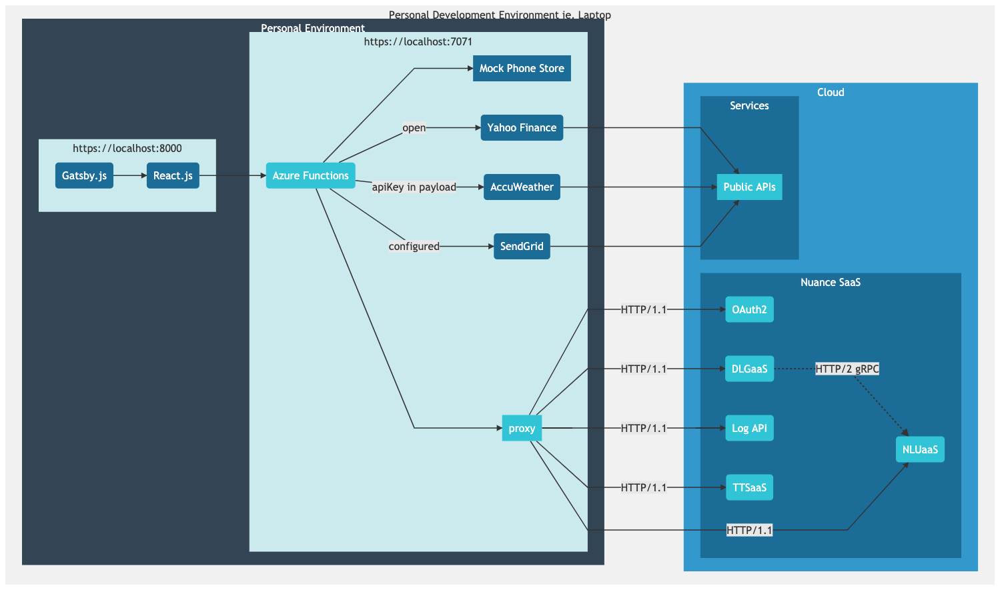
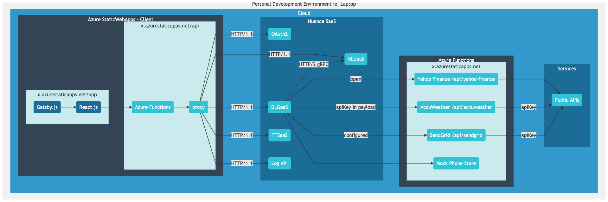

# Nuance Mix Demo Client

> Develop and Troubleshoot [Nuance Mix](https://nuance.com/mix) AI Powered Chat Bots locally and on Microsoft Azure.

## Table of contents
* [Overview](#overview)
* [About the Client](#about-the-client)
* [Setup](#setup)
* [Functionality](#functionality)
* [Pre-Requisites](#pre-requisites)
* [Quick Start 🚀](#quick-start-)
* [Getting Started](#getting-started)
* [Conventions for Rich UI](#conventions-for-rich-ui)
* [Conventions for Link Handling](#conventions-for-link-handling)
* [Data Access Integrations](#data-access-integrations)
* [Publishing to Azure](#publishing-to-azure)
* [License](#license)

## Overview

This demo client offers a sample integration to [Nuance Mix](https://www.nuance.com/mix?src=demo)'s Conversational AI [Runtime Services](https://docs.mix.nuance.com/runtime-services/#runtime-apis-quick-reference), specifically
* [Dialog (DLGaaS)](https://docs.mix.nuance.com/dialog-grpc/v1/)
* [Speech Recognition (ASRaaS)](https://docs.mix.nuance.com/asr-grpc/v1/)
* [Natural Language Understanding (NLUaaS)](https://docs.mix.nuance.com/nlu-grpc/v1/?src=demo)
* [Text to Speech (TTSaaS)](https://docs.mix.nuance.com/tts-grpc/v1/?src=demo) and the
* [Runtime Event Log API](https://docs.mix.nuance.com/runtime-event-logs/?src=demo)

The client uses the HTTP/1.1 transcoded, or WebSocket transport version of the APIs (rather than the native HTTP/2 gRPC versions).

The prime purpose of this tool is to assist in Bot development and troubleshooting, including offering controlled hosted availability using [Azure StaticWebApps](https://azure.microsoft.com/en-us/services/app-service/static/).

[Azure Functions](https://docs.microsoft.com/en-us/azure/azure-functions/) with [Core Tools](https://docs.microsoft.com/en-us/azure/azure-functions/functions-run-local) are used throughout the development and deployment lifecycle.

For more information on how to leverage the client across various environments, see [networking options](https://docs.microsoft.com/en-us/azure/azure-functions/functions-networking-options), and be sure to [secure your functions](https://docs.microsoft.com/en-us/azure/azure-functions/security-concepts). Monitoring is made available through [Application Insights](https://docs.microsoft.com/en-us/azure/azure-monitor/app/app-insights-overview).

*Disclaimer: This sample client is not intended to illustrate a production-ready implementation; it is intended to aid development, demonstration, troubleshooting, and other such use cases.*

## About the Client

* [Gatsby](https://www.gatsbyjs.com), [React](https://reactjs.org) and [React-Bootstrap](https://react-bootstrap.github.io/) for the Client/Frontend
* [Azure Functions Python](https://docs.microsoft.com/en-us/azure/azure-functions/functions-reference-python) for the API
  * Acts as a Proxy for Nuance Services, with Data Integrations for Mix.dialog/DLGaaS

## Setup

Please see the [Exchanging data](https://docs.mix.nuance.com/data-access/?src=demo) section in the [Mix documentation](https://docs.mix.nuance.com/?src=demo). It is crucial to understand the concepts as you design your Mix projects and leverage this client -- it acts more like a gateway.

## Functionality

* [x] Bot engagements using Nuance Mix's [DLGaaS](https://docs.mix.nuance.com/dialog-grpac/v1/?src=demo) **HTTP/1.1** or **WebSockets** (web-gRPC) API (_not_ HTTP/2 gRPC)
  * Audio or Text Input, Audio or Text Output
  * PRESENTATION LAYER: Rich UI through conventions
  * DATA: Functions for development through Client Fetch, and when deployed, enables External Fetch usage
  * DATA: Client Fetch handler for Location Data supplied in userData
  * LOGS: Log Events, Filtering and Timeline Visualization
  * CHANNEL SIMULATION: Visual VA, IVR, SmartSpeaker, SMS (audio in/out, text in/out, or any permutation)
* [x] Speech Recognition using [ASRaaS](https://docs.mix.nuance.com/asr-grpc/v1/?src=demo) **WebSockets** API (web-gRPC)
* [x] Natural Language Understanding using [NLUaaS](https://docs.mix.nuance.com/nlu-grpc/v1/?src=demo) **HTTP/1.1** API (not HTTP/2 gRPC)
* [x] Text to Speech Synthesis using [TTSaaS](https://docs.mix.nuance.com/tts-grpc/v1/?src=demo) **HTTP/1.1** API (not HTTP/2 gRPC)
* [x] Event data using the [Log Events](https://docs.mix.nuance.com/runtime-event-logs/?src=demo) **HTTP/1.1** API

### Intended Local Use

Use Data Access nodes with the `client_fetch` configuration and write the integration layer locally with the **intention** of separate hosted Functions (through `external_fetch`). These Functions would be referenced and configured within Mix.dialog and Mix.dashboard respectively.



### Intended Hosted Use

The following illustrates a scenario where the client is deployed to Azure, and Data Access nodes have been configured to use `external_fetch` within Mix.

This simplifies the client handling, deferring to the Functions themselves, and offers lifecycle controls within Mix.



⚠️ There may be scenarios where `client_fetch` is appropriate; this has been set up such that `dlgaas.js` will invoke local `ClientFetchHandlers`.

## Pre-Requisites

* [Git](https://git-scm.com/downloads)
* [Brew](https://brew.sh/) (MacOS/Linux) or [Chocolatey](https://chocolatey.org/) (Windows)
* [OpenSSL](https://www.openssl.org/) and [Mkcert](https://github.com/FiloSottile/mkcert/releases)
* If using Docker..
  * [Docker Engine](https://docs.docker.com/engine/install/) 20.10.0+
* If using a Native Host..
  * [Node.js](https://nodejs.org/en/download/) 14.3+ (Client Toolchain)
  * [Python](https://www.python.org/downloads/) 3.7+ (Functions)
  * [Azure Functions Core Tools](https://docs.microsoft.com/en-us/azure/azure-functions/functions-run-local)

## Quick Start 🚀

```bash
git clone git@github.com:nuance-communications/mix-demo-client-azstaticwebapps.git
```

Pre-requisite for either Docker or Native Host based:

```
make certs-setup
```

Assumes running the application using Docker: 

```bash
make launch
```

If using Native Host, run two processes:

```bash
make native-run-api-secure
```

```bash
make native-run-app-secure
```

## Getting Started

### Makefile

Various opertions are described in a Makefile. 

```bash
make help

CERTS:  certs-(prep|setup)
*LAUNCH:  launch
DOCKER:  containers-(build|run|restart|stop|status|logs|clean)
NATIVE.BUILD:  native-build-(app|api)
NATIVE.RUN:  native-run-(app|api)-(secure|insecure)
NATIVE.CLEANUP:  native-clean
DATA.ACCESS:  new-data-access-endpoint
```

There are two main modes of operation intended: docker and native host. Launch defaults to docker. 

#### Certificate Related

##### `make certs-prep`

Installs the pre-requisities for certificate creation, namely `openssl` and `mkcert`. A package manager is used here: brew or choco depending on your platform.

##### `make certs-setup`

Creates certificates and stores password as needed for local use.

#### Quick Start

##### `make launch`

Primary command, sets up certificates and runs with docker compose.

#### Docker Host

##### `make containers-build`

Builds the containers needed to run the app. Reflects the full static web app, including the APIs.

##### `make containers-run`

Runs the containers for the app. Reflects the full static web app, including the APIs.

##### `make containers-restart`

Restarts the containers of the app.

##### `make containers-stop`

Stops the containers running.

##### `make containers-status`

Provides status for the containers. 

##### `make containers-logs`

Follow the logs for the running containers.

##### `make containers-clean`

Removes all the images for the app.

#### Native Host

##### `make native-build-app`

Builds the client application package and brings in associated dependencies.

##### `make native-build-api`

Builds the functions package and sets up a virtual environment.

##### `make native-run-app-secure`

Runs the native application securely (leveraging certs).

##### `make native-run-api-secure`

Runs the native functions securely (leveraging certs).

##### `make native-run-app-insecure`

Runs the native application insecurely. Must update `local.settings.json` accordingly. Not default mode.

##### `make native-run-api-insecure`

Runs the native functions insecurely. Must update `local.settings.json` accordingly. Not default mode.

##### `make native-clean`

Cleans all application and functions related resources.

#### Data Access Endpoint Related

##### `make new-data-access-endpoint`

Helper to bootstrap a data access endpoint, leveraging a template.

### Setting Up Certificates

If you do not have `mkcert` or `openssl` installed:
```bash
make certs-prep
```

To set up the necessary certificates:
```bash
make certs-setup
```

### Option 1: Run with Docker

```bash
make containers-run
```

### Option 2: Run Natively

Run the two processes.

App:
```bash
make native-run-api-secure
```

API:
```bash
make native-run-api-secure
```

### Create a New Data Access Endpoint

```bash
make new-data-access-endpoint
```

See the official [Azure Functions Reference - Python](https://docs.microsoft.com/en-us/azure/azure-functions/functions-reference-python) for more information.

### Configuration

If using Docker, update the values in `.env`.

If running Natively, update the following environment variables to override the default values:

```bash
export oauth_server_url="https://auth.crt.nuance.com/oauth2"
export base_url_dlgaas="https://dlg.api.nuance.com/dlg/v1"
export base_url_nluaas="https://nlu.api.nuance.com/nlu/v1"
export base_url_ttsaas="https://tts.api.nuance.com/api/v1"
export base_url_logapi="https://log.api.nuance.com"
export oauth_scope="dlg nlu tts log"
```

When deployed, these can be set per deployment environment in the Azure Portal for the Static Web App.

#### local.settings.json

See `resources/local.settings.json` for the base file.

The default setting enable CORS for the Functions, and sets a worker count as desired. Be mindful of the `http` vs `https` distinction. By default, the application is set up to use `https`.

#### Email capabilities (Optional)

This sample offers a stub integration with SendGrid for email capabilities. 

This can be used if creating a Data Access node with the name `Server_Send_Email`, which in turn will call the `email-api-send` locally.

To configure this integration, provide the following environment variables:

```bash
export sendgrid_api_key="<REPLACE_ME>"
export sendgrid_from_email="<REPLACE_ME>"
export sendgrid_custom_token="<REPLACE_ME>"
```

Note: Override values as needed in `.env` when using `docker-compose`
⚠️ The _custom token_ must be provided in the Mix project named `SENDGRID_TOKEN`. This is to thwart unintentional usage.

## Conventions for Rich UI

This client employs certain conventions within Mix.dialog to offer special types of rendering in the presentation layer.

To take advantage of these, navigate to:
* QA node >  Node Properties
  * User Input > Optional > Interactivity

Provide the following strings in the "type" field.

Special Input Types for QA Nodes:

* `email`
* `phone`
* `currency`
* `date`

To provide hints (aka placeholders), the sendData must include a variable with the _type_ followed by 'Hint', ie. 'emailHint', 'phoneHint' and so on.

For Interactivity (aka selectables):

* `carousel`
* `buttons`
* `colorpicker` (description should contain the HEX value)

### Rich Text Modality

Note: when using Rich Text markup in messages, if elements contains classes from [Bootstrap](https://getbootstrap.com/docs/5.0/getting-started/introduction/) they will be rendered accordingly in this client. See `chat.js` to see the allowed DOM elements and attributes.

### Stub Images for Carousels with Selectables

Images can be rendered when using selectables and the `carousel` type. Edit `STUB_SELECTABLE_IMAGES` in `shared.js` to experiment with resources.

## Conventions for Link Handling

This client employes certain conventions within Mix.dialog to offer special types of event handling in the presentation layer.

To take advantage of these, simply mark up your Rich Text messages appropriately with the data attributes, depending on the intended interaction.

### Intent or Entity

To trigger an intent or entity selection, leverage the following attributes:

* `data-mix-action="selectable"`
* `data-mix-selectable-id` - can be `INTENT` or the entity name
* `data-mix-selectable-value`

#### Sample

```html
<a href="#"
  data-mix-action="selectable"
  data-mix-selectable-id="INTENT"
  data-mix-selectable-value="iBuyPhone">
    Buy a Phone
</a>
```

```html
<a href="#"
  data-mix-action="selectable"
  data-mix-selectable-id="ePhoneCapacity"
  data-mix-selectable-value="128GB">
    128GB
</a>
```

### Simulated Inputs

To trigger a simulated user input, leverage the following attributes:

* `data-mix-action="input"`
* `data-mix-input`

#### Sample

```html
<a href="#"
  data-mix-action="input"
  data-mix-input="$500">
    $500
</a>
```

## Data Access Integrations

### Using Client Fetch during development

This client offers developers the ability to use the `client_fetch` mode of the Data Accss node in Mix.dialog and integrate with an Azure Function.

This pattern would apply in a gateway-style integration, however the intention of _this_ set up, is to eventually have the integrations use `external_fetch` pointing to deployed Functions.

### How-To: Add Handlers for Data Access Nodes

Create a new Function specifying the endpoint URL and the data access node name to use if client-driven:

```bash
./scripts/create-da-handler.sh "weather-api-city-conditions" "Server_Weather_CityConditions"
```

Navigate to `api/weather-api-city-conditions/__init__.py` and start integrating.

By default, POST requests are expected with the body containing the sendData payload. Update `api/weather-api-city-conditions/function.json` if other methods are desired.

⚠️ Important: Once the function has been set up, add a handler to `ExternalFetchHandlers` in [dlgaas.js](./src/components/dlgaas.js#L27). Create a function with the Data Access node's name, pointing to the newly defined endpoint.

### Data Access Requests intended for the Client

There are cases where the use of Mix.dialog Data Access node's client fetch is intended for the end client (vs. the gateway pattern employed here).

#### How-To: Add Handlers for Client Actions

Add a handler to `ClientFetchHandlers` in [dlgaas.js](./src/components/dlgaas.js#L65) named with the Data Access node's name.

#### Client Location Capability

At this time, geolocation (lat/lng) is supported through the HTML5 API, when the client is running securely.

To request the client to provide it's location, set the Data Access node's ID to **`Client_Location_LatLng`**, and this will return a `location` object.


### Sample Data Integrations

The data integration layer in this client is handled through Functions, and complimented by sample integrations in [`api/providers.py`](./api/providers.py).

Each data access access is represented by it's own Function, in preparation for use when deployed and hosted.

This client illustrates integrations with: [Yahoo Finance](./api/providers.py#L45), [AccuWeather](./api/providers.py#L64), [SendGrid](./api/providers.py#L18) and a [Mock Phone Store](./api/providers.py#L124).

#### **Yahoo Finance**

This API does not require authentication, in this case: the requests are made with no further checks.

   * `POST /api/finance-api-asset-price`

#### **AccuWeather**

Third party service authentication is required and done through passing the token in the payload of the request. In this case: `apiKeyAccuweather` is used with the service and must be saved in the session (stored in a variable).

   * `POST /api/weather-api-city-search`
   * `POST /api/weather-api-city-conditions`

#### **SendGrid**

Third party service authentication is configured as part of the Function, but a `SENDGRID_TOKEN` is required to execute calls from known sources.

In this case: the token must been assigned in Mix at the PROJECT level.

   * `POST /api/email-api-send`

#### **Mock Phone Store**

This integration illustrates the use of Dynamic Wordsets, consistently filtering options based on the user's selection, derived from static data.

   * `POST /api/store-api-filter-phone-wordset`
   * `POST /api/store-api-request-purchase`
   * `POST /api/store-api-purchase`


## Deployment

### Publishing to Azure

To deploy this client, follow the [Azure StaticWebApps deployment guide](https://docs.microsoft.com/en-us/azure/static-web-apps/publish-gatsby) to publish. Update `app/static/staticwebapp.config.json` as needed.

Essentially:

1. Create a GitHub Repo
2. Create an Azure StaticWebApp pointing to the GitHub Repo (use: gatsby, point to `app/`, and `api/`)
3. Configure accordingly in Azure
   * Create a [Application Insights](https://docs.microsoft.com/en-us/azure/azure-monitor/app/app-insights-overview) resource and link to StaticWebApp (`APPINSIGHTS_INSTRUMENTATIONKEY`)
   * Add environment variables (`sengrid_api_key`, `sendgrid_from_email`)

### Considerations 

1. update content-security-policy for client - `staticwebapp.config.json`
2. update client host (ASR_SERVICE_URL, DLG_SERVICE_URL) - `shared.js`
3. update environment variables for functions - `.env`

## License

This source code is licensed under the **Apache-2.0** license found in the LICENSE.md file in the root directory of this source tree.
